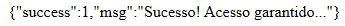

# Atividade SQL Injection

Apresente um código (pode ser em qualquer linguagem) que possa estar sujeito a ataques de SQL Injection e/ou Força Bruta. Faça implementações deixem o código mais seguro, em relação esses tipos de ataques, então explique qual(is) o(s) tipo(s) de ataque que está(ão) sendo evitados e qual a parte do código que evita esse ataque.

## Resultados de ataques

### SQL Injection

Para começar a executar um SQL Injection, primeiro precisamos executar essa URL que liga diretamente ao SQL.

```
http://localhost/Atividade_SQL_Injection/index.php?user=hello' OR '1' = '1&password=hello' OR '1' = '1
```

Nesse caso, vemos que o ``hello`` e o último ``1`` estão acompanhado de ``'`` no começo e fim do valor de cada variável. Isso porque no código SQL original, ele cobre o valor com uma aspa única no início de cada palavra de cada variável respectiva.

O código SQL gerado pela URL acima será:

```sql
SELECT * FROM usuarios WHERE user='hello' OR '1' = '1' AND password='hello' OR '1' = '1'
```

Nesse caso ele está perguntado para o usuário se ele é igual ao nome ``hello`` ou o valor booleano ``True``, já que ``'1' = '1'`` é igual a ``True``, a mesma lógica é aplicada na senha.

Como os dois valores são ``True``, então o ``SELECT * FROM usuarios`` irá mostrar tudo ao invés de um valor específico já que tudo é ``True``.

Com isso, o resultado que ele dará para a gente será o acesso ao sistema.



### Brute-Forcing

Para começar a fazer o brute-forcing até descobrir o usuário e a senha correta para liberar a tabela inteira dos usuários, precisamos de um script para testar todas as opções até chegar uma que dê o resultado que a gente queira.

Eu criei um script Python com esse propósito.

```python
import urllib.request
import json
import os

os.chdir(os.path.dirname(os.path.abspath(__file__)))

with open('rockyou.txt', "r", encoding="utf-8", errors="ignore") as file:
  dictionary = [line.strip() for line in file if ' ' not in line]

for user in dictionary:
  for passwd in dictionary:
    url = "http://localhost/Atividade_SQL_Injection/index.php?user=" + user + "&password=" + passwd + ""
    response = urllib.request.urlopen(url)
    html = response.read().decode('utf-8')
    data = json.loads(html)
    if data["success"] == 1:
      print("Quebrado com successo!")
      break
```

Nesse caso ele utiliza um ataque de dicionário para não gastar tanto tempo testando letra por letra até algo dar certo.

Essa forma só vale a pena caso você tenha muito tempo nas mãos para ficar testando mais de 14 milhões de senhas para cada usuário.

Ou seja, a notação em Big-O é de ``O(n^2)``.

Mas nesse caso, ele só funciona caso a senha não tenha um hash como o Argon2id, mas isso é assunto pra outra hora, já que irá depender de como o servidor valida o hash e como é armazenado no banco de dados.

## Resultados de proteção

### Prepared Statements

Com o Prepared Statement, a query SQL não é mandada junto com o valor pedido.

```php
$stmt = $conexao->prepare("SELECT * FROM usuarios WHERE user=? AND password=?");
$stmt->bind_param("ss", $_GET["user"], $_GET["password"]);
```

Em comparação a maneira insegura.

```php
$sql = "SELECT * FROM usuarios WHERE user='" . $_GET["user"] . "' AND password='" . $_GET["password"] . "'";
```

Nesse caso, com o Prepared Statement, ele mandaria o valor em si ao invés de complementar a string, por exemplo

```
http://localhost/Atividade_SQL_Injection/index_safe.php?user=hello' OR '1' = '1&password=hello' OR '1' = '1
```

O valor que iria mandar para o banco de dados para o usuário e para a senha seria ``hello' OR '1' = '1`` e não ``'hello' OR '1' = '1'``.

Ou seja, ele tentaria procurar um usuário (ou senha) com o valor ``hello' OR '1' = '1``.

O que iria mitigar o problema do SQL Injection para modificar a query dada.

### Rate Limit

No caso do brute-force, a maneira mais sensata seria criar um rate limit para cada vez que o usuário errasse o seu nome de usuário e a sua senha.

```php
$ip = $_SERVER['REMOTE_ADDR'];
if ($ip == '::1') {
    $ip = '127.0.0.1';
}

if ($resultado->num_rows > 0) {
    $response["success"] = 1;
    $response["msg"] = "Sucesso! Acesso garantido...";
    unset($_SESSION['rate_limit']);
} else {
    $response["success"] = 0;
    $response["msg"] = "Erro! Acesso negado...";
    $_SESSION['rate_limit'][] = $ip;
}
```

Pois caso ele errasse ele voltaria ao mesmo canto e iria diminiuir o tanto de vezes que ele poderia errar.

Caso ele errasse mais de 5 vezes, ele entraria num timeout de 5 minutos até que ele pudesse tentar de novo.

O contador persiste por sessão, ele pode errar até 5 vezes e ter que esperar até 5 minutos. Caso ele erre 4 vezes, ele só tem mais uma chance até ir para o timeout mais uma vez.

O tanto de vezes que ele pode errar está guardado em uma array.

```php
$rate_limit_count = 5;
$timeout_minutes = 5;

if (count($_SESSION['rate_limit'], 0) >= $rate_limit_count) {
    if (!isset($_SESSION['timer_start'])) {
        $_SESSION['timer_start'] = time();
    }

    $duration = $timeout_minutes * 60;
    $elapsed = time() - $_SESSION['timer_start'];
    $remaining = $duration - $elapsed;

    if ($remaining <= 0) {
        unset($_SESSION['timer_start']);
        unset($_SESSION['rate_limit']);
    } else {
        $minutes = ceil($remaining / 60);
        echo "Por favor, aguarde mais {$minutes} minuto(s) antes de tentar novamente.";
    }
}
```